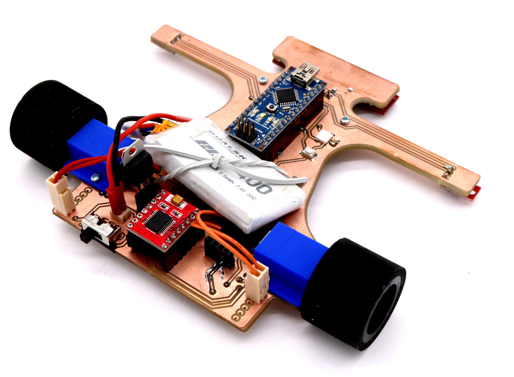
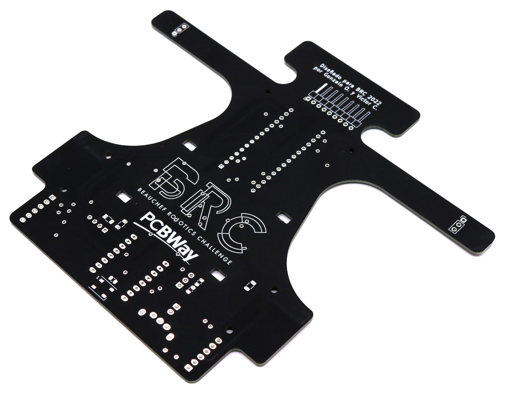

# BRCito 2022

[![CC BY NC SA 4.0][cc-by-nc-sa-shield]][cc-by-nc-sa]

Robot velocista sigue-líneas desarrollado para BRC 2022.

El objetivo de este robot es servir de referencia y plataforma para apoyar la formación de los competidores. Está desarrollado en base a las tecnologías disponibles en un FabLab (impresión 3D, fresado de PCBs, Arduino) y comprende las componentes más básicas para funcionar de acuerdo a las reglas de la competencia.

Para poder entregar robots a los colegios participantes de la liga **Sub18** recibimos auspicio de [PCBWay](https://www.pcbway.com/) quienes nos otorgaron las placas electrónicas.

## Diseño

### Antecedentes

Las funciones principales requeridas por el robot son:

- Distinguir una línea blanca en un fondo blanco
- Moverse lo más rápido posible, sin salirse de la pista

Para cumplir estas funciones, el robot requiere una construcción óptima en cuanto al tamaño/peso y las prestaciones de sus componentes que cumplirán estas funcionalidades. El diseño del robot puede seguir diferentes configuraciones (arreglos de sensores, motores, baterías, etc), dependiendo del tipo de control que se vaya a utilizar. Otras funciones secundarias corresponden a la interacción con el usuario (encender/apagar, activar, indicar acciones), así como cualquier otra que se desee agregar (como comunicación inalámbrica para el debugging).

En el contexto de la competencia, existirán marcadores a los costados del circuito que indicarán hitos como curvas, inicio y fin de la pista. También se fija el tamaño máximo como 25x25x20 centímetros (largo, ancho y alto) y que las ruedas no pueden contener elementos adherentes que dañen la pista.

### BRCito Negro PCBWay

El robot sigue líneas es controlador por un Arduino Nano. Las conexiones del Arduino con los sensores, necesarias para realizar su programación se pueden ver en la tabla

#### Pinout electrónico
| Pin Arduino     | Descripción     | Componente | Pin componente
| :------------- | :------------- | :-------      | :-----  |
| A2       | Sensor Frontal 1      | Arreglo sensores QTR-8A | 6
| A3       | Sensor Frontal 2      | Arreglo sensores QTR-8A |5
| A4       | Sensor Frontal 3      | Arreglo sensores QTR-8A |4
| A5       | Sensor Frontal 4      | Arreglo sensores QTR-8A |3
| A6       | Sensor Frontal 5      | Arreglo sensores QTR-8A |2
| A7       | Sensor Frontal 6      | Arreglo sensores QTR-8A |1
| 6        | Rueda izquierda PWM      | Driver motor TB6612FNG | PWMA
| 13       | Rueda izquierda A      | Driver motor TB6612FNG  | AI1 |
| 10       | Rueda izquierda B      | Driver motor TB6612FNG | AI2  |
| 5        | Rueda derecha PWM      | Driver motor TB6612FNG | PWMB |
| 11       | Rueda derecha A      | Driver motor TB6612FNG  | BI1 |
| 12       | Rueda derecha B      | Driver motor TB6612FNG | BI2  |
| A1       | Sensor derecho      | Sensor QTR-1A | out
| A0       | Sensor izquierdo      | Sensor QTR-1A | out
| 9       | Leds RGB      | Led RGB | din led
| 7       | Pulsador      | Pulsador | pin pulsador

### Librerías de Kicad

En la carpeta [pcb/libs/](pcb/libs/) se encuentran las librerías de símbolos y footprints diseñados para los componentes que no existen en las librerías estandar de KiCad.

**Librería de símbolos**
* TB6612FNG_breakout

**Librería de footprints**
* QTR-8
* SPST Slide Switch (interruptor)
* TB6612FNG Breakout

## Librerías de Arduino

Para comunicarse con los leds WS2812b se puede utilizar la librería [Adafruit Neopixel](https://github.com/adafruit/Adafruit_NeoPixel).

Para los sensores infrarrojos QTR se puede utilizar la librería [QTR Sensors](https://github.com/pololu/qtr-sensors-arduino).

## Licencia
[![CC BY NC SA 4.0][cc-by-nc-sa-image]][cc-by-nc-sa]

Este trabajo esta publicado bajo la licencia [Creative Commons Attribution-NonCommercial-ShareAlike 4.0 International
License][cc-by-nc-sa].

Si deseas utilizar nuestro robot en tus proyectos o si te interesa vender las placas, contáctanos y conversemos :)

[cc-by-nc-sa]: https://creativecommons.org/licenses/by-nc-sa/4.0/
[cc-by-nc-sa-image]: https://i.creativecommons.org/l/by-nc-sa/4.0/88x31.png
[cc-by-nc-sa-shield]: https://img.shields.io/badge/License-CC%20BY%20NC%20SA%204.0-lightgrey.svg
